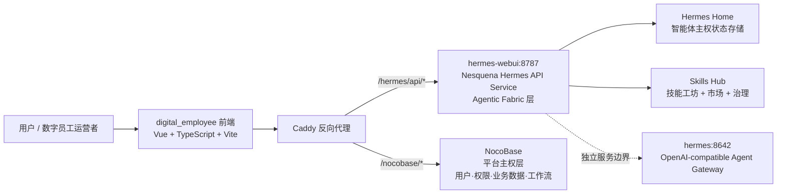
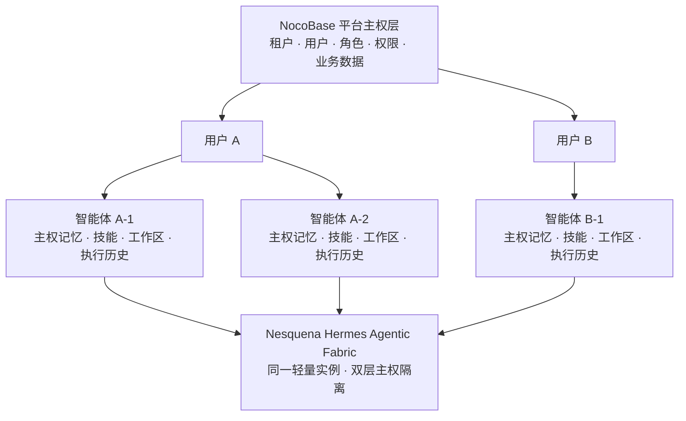

# 🌀 Nesquena Hermes —— 企业级 Agentic Fabric

> **从「给一个人用的聊天机器人」，进化成「组织真正拥有并治理的数字员工 workforce」。**  
> Nesquena Hermes 是让企业能够安全运行、治理和规模化编排专业化数字员工的**主权级 Agentic Fabric**。

**Nesquena Hermes API Service** 把原本单用户的 Hermes，升级为一个**生产级、多租户、可治理的 Agentic Fabric** —— 在这个底座上，数字员工拥有持久身份、隔离记忆、可审计行为，以及可被创建、审核、发布和复用的技能资产。

这不是又一个 LLM 的包装壳。
这是**连接原始 Agent 能力与企业现实之间缺失的编排与治理层**。

---

## 🌍 时代转向：从工具到数字员工

今天绝大多数「AI Agent」仍然是高级聊天机器人 —— 被动响应、无状态、活在个人浏览器里。

企业真正需要的不是更多聊天机器人。
他们需要的是能够执行真实跨系统工作流、积累组织长期记忆、组成专业团队、在明确治理边界下自主运行的 **Digital Workers（数字员工）**。

Nesquena Hermes 正是为这场转变而生 —— 将 Hermes 强大的原生 Agentic 能力，转化为一个**可治理、可隔离、可资产化**的数字劳动力平台。

---

## ✨ Agentic Fabric 的核心能力

### 1. 双层主权隔离织网（Dual-Layer Sovereign Isolation Fabric）
企业级信任的基石。

传统 Agent 平台要么让所有人共享状态，要么被迫为每个用户单独部署。Nesquena Hermes 提供了真正的**双层主权隔离**：

- **平台层（NocoBase）**：负责用户身份、角色、权限和业务数据主权。
- **智能体层（Hermes 原生）**：每个智能体（数字员工）都拥有完全独立的会话、长期记忆、技能、工作区和执行状态。

结果是：同一个轻量服务实例可以安全承载数百用户、数千数字员工，同时每个请求只能看到它被授权看到的内容。零数据泄露，零意外的智能体间污染。

这就是让「规模化治理」成为可能的**企业级智能体隔离矩阵**。

### 2. 智能体主权空间 —— 每个数字员工都有自己的房间
智能体不再是临时会话，而是一个拥有持久身份的**数字员工**，具备：

- 跨会话、跨任务的长期记忆织网
- 私有技能 + 公共技能双轨体系
- 专属工作区与文件系统
- 模型偏好与行为护栏
- 完整执行历史与状态

用户只能看到并操作属于自己的智能体。智能体之间除非通过受治理的转交通道，否则无法互相看到记忆和上下文。

这就是从「我有一个 Agent」到「我运营一支专业数字员工团队」的根本区别。

### 3. 主权技能工坊与 Agent Marketplace
技能不再是散落的个人脚本，而是成为**组织级资产**。

- 在 Skill Forge 中创建、测试、版本化并发布技能
- 将技能提交至内部市场，经管理员审核后才能上架
- 审核通过后，其他用户的智能体可一键安装使用
- 私有技能始终只对创建者可见

这在组织内部形成了真正的**智能体技能经济** —— 高价值能力可以复用和 compounding，而不是每个人都重复造轮子。

### 4. 数字人才招募与智能体入职
招募数字员工，应该像招人一样严肃和顺畅。

Nesquena Hermes 把「使用 Agent」变成了真正的**入职体验**：

- 浏览公共/内部人才池中的预构建、受治理智能体
- 一键将专业数字员工招募到自己的主权工作空间
- 该智能体自带记忆、技能和执行上下文，开箱即用

不再是复制粘贴系统提示词，而是真正的智能体身份转移 + 治理。

### 5. 主动执行织网（Proactive Execution Mesh）
数字员工不应该只等人类下指令。

Nesquena Hermes 为每个智能体配备了**主动执行织网**：

- 日历视图、定时触发、事件驱动执行
- 完整执行历史、暂停/恢复、手动干预、审计轨迹
- 支持日报、合规巡检、数据同步、监控告警等真实生产任务的自主运行

这就是把「会聊天的 Agent」和「真正能干活的数字劳动力」区分开来的关键。

### 6. 认知治理与合规控制面（Cognitive Governance & Compliance Plane）
这是企业最在意的部分。

原始 Agent 能力强大，但在规模化时充满风险。Nesquena Hermes 补上了缺失的**治理与合规控制面**：

- 技能进入市场的管理员审核与准入流程
- 实时用量遥测、Token 消耗追踪与配额管控
- 智能体行为、决策、工具调用的完整可审计性
- 健康监控、系统可观测性与确定性控制边界

正如 X 上企业声音所说：「企业平台要能治理 Agent 权限、审计、控制并强制执行……要能确定性地保障合规。」

Nesquena Hermes 让这句话在 Hermes 强大引擎之上成为现实。

### 7. 持久认知连续性层（Persistent Cognitive Continuity Layer）
记忆不是锦上添花，而是数字员工能真正发挥价值的根基。

Nesquena Hermes 提供了**持久、跨会话、跨任务的认知连续性**：

- 长期记忆在会话重置后依然存在
- 上下文压缩而不造成灾难性遗忘
- 记忆可在智能体间选择性共享或严格隔离
- 完整支持终端、文件操作、工具调用与人在回路审批流程

智能体终于可以积累真正的组织知识，而不是每次会话都重置。

---

## 🏗️ 架构 —— 两层主权，一张连贯织网

### 产品链路



### 隔离模型（真正的企业护城河）



**核心设计**：NocoBase 负责**平台级主权**，Hermes 负责**智能体级主权**。两者叠加后，同一个服务即可安全支撑企业级规模的数字员工团队，同时保持严格的隔离与审计边界。

---

## 🧠 核心概念（我们真实构建的）

| 概念 | 实际含义 | 企业为什么在意 |
|------|----------|----------------|
| **双层主权隔离织网** | 平台权限 + 原生智能体级隔离 | 安全的多租户，无需为每个用户单独部署 |
| **智能体主权空间** | 每个数字员工拥有持久身份、记忆和技能 | 从「我提示了一个 Agent」变成「我运营受治理的数字员工团队」 |
| **主权技能工坊与市场** | 技能成为可审核、可发布、可复用的组织资产 | 能力复用与 compounding，而非不断重复造轮子 |
| **主动执行织网** | 支持 Cron 与事件驱动的自主工作流 + 完整审计 | 数字员工真正能干活，而非需要人一直盯着 |
| **认知治理与合规控制面** | 管理员审核、遥测、配额、审计轨迹 | 从「强大的 Agent」到「可部署的数字劳动力」的关键区别 |
| **持久认知连续性层** | 跨会话、跨任务的长期记忆 | 智能体能积累真正的组织知识 |

---

## 📊 关键差异化对比

| 维度           | 原生 Hermes          | 普通「Agent 平台」       | Nesquena Hermes Agentic Fabric              |
|----------------|----------------------|--------------------------|---------------------------------------------|
| 用户隔离       | 无（单用户）         | 通常较弱 / 共享状态      | 真正的双层主权隔离                          |
| 智能体身份     | 临时会话             | 往往只是提示词           | 持久主权工作空间                            |
| 技能体系       | 个人脚本             | 有限市场                 | 完整生命周期 + 管理员治理的市场             |
| 治理能力       | 无                   | 基础日志                 | 真正的合规控制面 + 审计 + 审批流程          |
| 主动执行       | 有限                 | 参差不齐                 | 一等公民的 Cron + 工作流编排                |
| 记忆           | 会话绑定             | 经常重置                 | 持久的跨会话组织记忆                        |
| 企业就绪度     | 个人工具             | 营销话术                 | 从第一天就为受治理的数字劳动力而生          |

---

## 🚀 快速开始

```bash
# 生产部署（推荐）
./scripts/deploy-172.sh

# 本地开发
python3 bootstrap.py
# 或
./ctl.sh start
```

部署流程已内置健康检查、CORS 验证和冒烟测试。

---

## 🛠️ 技术栈

- **核心**：Python 3.12 + ThreadingHTTPServer（刻意保持轻量，避免重框架债务）
- **Agent 引擎**：NousResearch Hermes（完整工具调用、记忆、插件系统）
- **流式**：Server-Sent Events（实时对话、审批、澄清事件）
- **隔离与状态**：Hermes home 文件系统 + 严格的 per-profile 边界
- **平台层**：NocoBase（用户、权限、业务工作流主权）
- **反向代理**：Caddy
- **可观测性**：内置健康检查、用量遥测与结构化日志
- **部署**：Docker + Docker Compose，一键生产发布

我们刻意不引入重型框架，让 Fabric 始终贴近 Hermes 强大的原生能力，同时叠加企业级治理层。

---

## 📦 部署内容

- `hermes-webui:8787` —— 完整的 Nesquena Hermes Agentic Fabric（本仓库）
- `hermes:8642` —— 独立的 OpenAI-compatible Agent Gateway（除非明确需要，否则不要重启）

两个服务边界清晰，只重建需要重建的部分即可。

---

## 🔮 愿景

我们正在从「数百万孤立的 App」走向「数十亿专业化 Agent」。

但如果没有治理、隔离、记忆连续性和组织级技能 compounding，Agent 能力只会制造更多混乱，而非创造价值。

Nesquena Hermes 存在的意义，就是成为让数字员工在企业规模下**安全、可审计、真正可用**的**主权级 Agentic Fabric**。

不是又一个聊天机器人平台。
而是**数字劳动力时代**的真正基石。

---

## 📜 许可

基于 MIT License（保留原 Hermes 许可声明）。

用过度的野心，以及对「企业 deserves 比 prompt-wrapped toys 更好的东西」的坚定信念构建。

---

**Nesquena Hermes** —— 你的数字员工 workforce 应得的 Agentic Fabric。

如果你的组织已经准备好从「我们试了几个 Agent」进化到「我们正在运行一支受治理的数字员工团队」，这个项目就是为你而生。

欢迎加入这场从工具到数字劳动力的真正转变。
