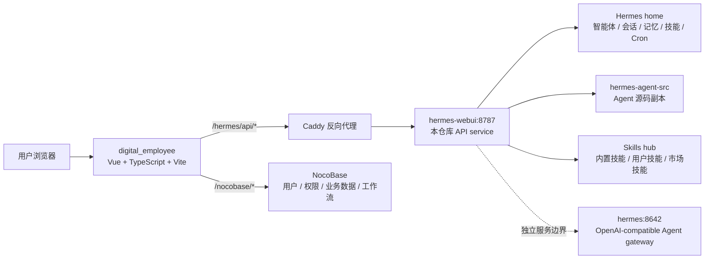
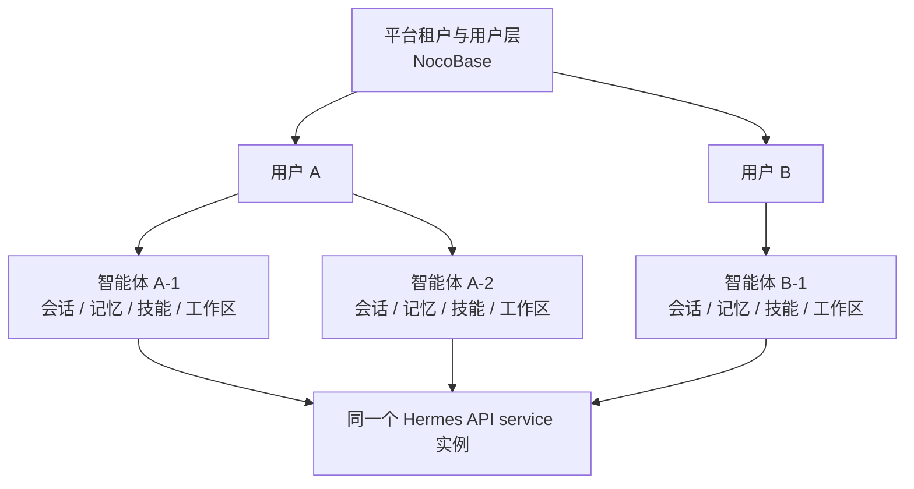

# Nesquena Hermes API Service

> 这是把原本“给一个人用”的 Hermes，改造成“给一群人用”的数字员工底座。
>
> 原生 Hermes 更像一个单人工作台。Nesquena Hermes API Service 则把它升级成一个可被平台调用、可被多人隔离、可被管理员治理、可被持续运营的 Agent 服务层。

## 产品定位

让Hermes不是一个聊天壳子，给 Hermes 加上了三层关键能力：

| 升级点 | 说明 |
|---|---|
| 用户隔离 | 原生 Hermes 没有“用户”概念，默认是一个人独占一套环境；现在可以让多个人共同使用同一个服务，但彼此看不到对方的数据。 |
| 智能体隔离 | 每个用户只能看到自己的智能体，看不到别人的智能体；会话、记忆、工作区、技能和模型偏好都跟着智能体走。 |
| 权限概念 | 我们把用户分成管理员和普通用户，管理员负责审核、治理和用量追踪，普通用户负责使用和创建自己的数字员工。 |

这意味着 Hermes 不再只是一个个人 Agent，而是一个面向企业内部数字员工平台的中台能力。

## 产品能力

### 1. 智能体空间

智能体是每个用户真正的工作空间，也是数字员工的“个人房间”。

- 用户只能看见自己的智能体。
- 每个智能体都有独立的会话、记忆、工作区、模型偏好和运行状态。
- 智能体里可以安装公共技能，也可以保留自己的私有技能。
- 智能体还可以作为单个数字员工的运行载体，承接不同场景的工作方式。

### 2. 技能工坊

技能不是散落在系统里的配置，而是可以被生产、提交、审核、分发的产品能力。

- 用户可以在技能工坊里创建、编辑、测试和发布技能。
- 智能体可以从公共技能市场添加技能，快速扩展能力。
- 技能模板支持提交到市场审核，管理员确认后再发布。
- 这套机制让技能从“个人脚本”变成“可流通资产”。

### 3. AI 员工招募

我们把“招募”做成了一个真正的产品动作。

- 用户可以从公共人才池里挑选现成的智能体。
- 一键把公共智能体变成自己的智能体。
- 这不是复制一个配置文件，而是把一个可用的数字员工纳入自己的工作空间。

### 4. 日程与待办

让数字员工不只会回答问题，还能主动干活。

- 支持日历视图、定时触发、执行历史、手动运行、暂停和恢复。
- 任务可以挂在特定智能体下运行。
- 适合日报、提醒、巡检、备份、审计和周期性自动化。

### 5. 邮箱

邮箱不是孤立功能，而是数字员工对外协作的入口之一。

- 支持用户邮箱账号的管理。
- 可以和自动化、通知、任务触发结合。

### 6. 通讯录

通讯录承接的是平台里的关系网络。

- 用户可以维护自己的联系人。
- 联系人关系和个人卡片独立管理。
- 适合把数字员工放进真实的组织关系里，而不是只停留在对话框里。

### 7. 管理员端

管理员不是只看配置的人，而是平台秩序的维护者。

- 管理员可以审核技能模板。
- 管理员可以看到用户用量追踪。
- 管理员可以做权限分层、市场准入和运行治理。

### 8. 持续记忆与协作

- 对话支持流式输出、上下文恢复、中断、重试和压缩。
- 记忆支持跨会话积累。
- 终端、文件、工具调用和审批流程让数字员工不只是“会说”，也能“会做”。

### 平台边界

通讯录、AI 员工招募、管理员审核、多用户权限和部分业务工作流主要由 `digital_employee` 前端和 NocoBase 承担。本仓库负责 Hermes 的能力底座、智能体隔离、技能运行、Cron 自动化和运行观测，不伪造平台业务数据。

## 架构图

### 产品链路



### 隔离模型



NocoBase 负责平台级用户、角色、权限和业务数据隔离；本服务负责 Hermes 层的智能体隔离。两层组合后，同一个服务实例可以承载多个用户和多个数字员工，但请求只能看到当前用户可访问的智能体与业务数据。

## 技术栈

| 层级 | 技术 | 当前用途 |
|---|---|---|
| 后端语言 | Python 3.12 | API service、状态读写、路由分发、Agent 调用封装 |
| HTTP 服务 | `ThreadingHTTPServer` | 轻量 HTTP server，无 FastAPI/Flask/Django 依赖 |
| 配置解析 | `pyyaml` | 读取 Hermes / WebUI 配置 |
| Agent 引擎 | NousResearch Hermes Agent | 模型适配、工具调用、记忆、Cron、Skills、插件 |
| 流式协议 | Server-Sent Events | 对话增量输出、审批和澄清事件推送 |
| 容器化 | Docker / Docker Compose | 生产运行 `hermes-webui` 服务 |
| 反向代理 | Caddy | `/hermes/*`、`/nocobase/*` 和静态前端路由 |
| 前端产品 | Vue + TypeScript + Vite | 位于独立 `digital_employee` 仓库 |
| 业务平台 | NocoBase | 用户、权限、多租户、通讯录、员工招募、技能市场审核、业务工作流 |
| 业务数据库 | PostgreSQL | NocoBase 底层数据库 |
| 状态存储 | Hermes home 文件系统 | 智能体、会话、记忆、技能、Cron、工作区等 Agent 状态 |
| 评测工具 | Node.js 24 + promptfoo | 用户技能可用性评测 |

## 运行架构

```text
digital_employee Vue 前端
  ├─ /hermes/*   -> Caddy -> hermes-webui:8787 -> 本仓库 API service
  └─ /nocobase/* -> Caddy -> https://www.foxuai.com/api/* -> NocoBase

hermes-webui:8787
  ├─ 读写共享 Hermes home: /var/www/hermes-agent/.hermes
  ├─ 使用挂载的 agent 源码副本: /var/www/nesquena-hermes-webui/hermes-agent-src
  └─ 对外提供 /api/*，不承载内置浏览器 UI

hermes:8642
  └─ 独立 Hermes Agent gateway / OpenAI-compatible API Server
```

`8787` 和 `8642` 是两个不同服务边界。部署本仓库时只重建 `hermes-webui`，不要顺手重启独立 `hermes` gateway，除非任务明确要求部署 Agent gateway。

## 模块树

| 模块 | 关键文件或目录 | 产品职责 |
|---|---|---|
| 服务入口 | `server.py`、`bootstrap.py`、`ctl.sh` | 启动服务、处理请求生命周期、鉴权、CORS、智能体 cookie 上下文、进程管理 |
| 路由分发 | `api/routes.py`、`api/routes_dispatcher.py`、`api/routes_handlers/`、`api/routes_helpers/` | 维护稳定 `/api/*` 路由入口，并把产品能力拆到 handler/helper |
| 认证 | `api/auth.py` | 密码登录、token login、`hermes_session` HttpOnly cookie、登录态校验 |
| 智能体空间 | `api/profiles.py`、`api/routes_handlers/profile.py`、`api/routes_helpers/profile_filter.py` | 数字员工档案创建、切换、隔离、用户绑定和智能体文件/记忆读写 |
| 会话 | `api/models.py`、`api/agent_sessions.py`、`api/session_ops.py`、`api/session_recovery.py`、`api/routes_handlers/session_*` | 会话列表、创建、恢复、搜索、归档、分支、压缩、重试和导入 |
| 对话流 | `api/routes_handlers/chat.py`、`api/streaming.py`、`api/clarify.py` | 聊天请求、SSE 流式输出、中断、澄清、审批事件和 Agent 线程运行 |
| 记忆 | `api/routes_handlers/memory.py`、`hermes-agent-src/agent/memory_*` | 长期记忆读写、智能体记忆和 Agent 侧记忆提供者 |
| 日程与待办 | `api/routes_handlers/cron_read.py`、`api/routes_handlers/cron_write.py`、`api/services/cron_service.py`、`hermes-agent-src/cron/` | 定时任务 CRUD、日历视图、执行历史、手动触发和后台调度 |
| 技能工坊与市场 | `api/routes_handlers/skill.py`、`scripts/ensure_*skill*fields.py`、`hermes-agent-src/skills/` | 技能浏览、安装、编辑、导入、测试、市场发布、审核和 Agent 技能执行 |
| 工作区与文件 | `api/workspace.py`、`api/routes_handlers/file*.py` | 工作区管理、文件浏览、上传、下载、保存、重命名和 raw 文件访问 |
| 终端 | `api/routes_handlers/terminal.py`、`hermes-agent-src/agent/shell_hooks.py` | 终端会话创建、输入、输出、resize、关闭和 Agent shell hook |
| 模型与提供商 | `api/live_models.py`、`api/providers.py`、`api/routes_helpers/model_resolve.py` | 模型列表、provider 配置、模型解析、用户 provider 同步 |
| MCP 与插件 | `api/routes_handlers/mcp.py`、`hermes-agent-src/plugins/` | MCP server/tool 查询、插件能力、外部工具扩展 |
| 审批和转交 | `api/routes_handlers/approval*.py`、`api/routes_handlers/handoff.py` | 敏感操作审批、审批 SSE、会话转交和任务交接 |
| 观测与用量 | `api/routes_handlers/logs.py`、`api/usage_telemetry.py`、`api/metering.py`、`api/system_health.py`、`api/agent_health.py` | 日志读取、健康检查、Agent 状态、Token/API 用量追踪 |
| 部署 | `Dockerfile`、`docker-compose.yml`、`scripts/deploy-172.sh`、`docs/deploy-172.md` | 镜像构建、172 服务器发布、health/CORS smoke、回滚和部署事实记录 |

## 数据归属

| 数据 | 事实源 | 说明 |
|---|---|---|
| 用户、角色、权限、租户 | NocoBase | 平台用户体系和权限边界 |
| 通讯录、员工招募、用户态工作流 | NocoBase + 前端产品 | 平台业务数据，不在本仓库本地伪造 |
| Profile、会话、记忆、日程与待办、工作区 | Hermes home 文件系统 | 本服务按 Profile 隔离读写 |
| 用户技能文件 | Hermes home / skills hub | 用户创建、导入、测试和安装的技能 |
| 技能模板、审核状态、驳回原因 | NocoBase + 本服务脚本/接口 | 技能市场、技能工坊和管理员审核使用 |
| 模型和 provider 配置 | Hermes config + WebUI state | 支持用户级 provider 和模型选择 |
| 运行日志、健康状态、用量追踪 | 本服务运行态 + 必要的业务表 | 用于运维、审计、配额和计费 |

## 关键 API 面

| 能力 | 主要接口 |
|---|---|
| 登录 | `POST /api/auth/token-login`、`POST /api/auth/login`、`POST /api/auth/logout` |
| 智能体空间 | `GET /api/profiles`、`POST /api/profile/switch`、`POST /api/profile/create`、`POST /api/profile/create-agent` |
| 会话 | `GET /api/sessions`、`POST /api/session/new`、`POST /api/session/rename`、`POST /api/session/archive`、`POST /api/session/compress` |
| 对话 | `POST /api/chat`、`POST /api/chat/start`、`GET /api/chat/stream`、`POST /api/chat/cancel` |
| 记忆 | `GET /api/memory`、`POST /api/memory/write`、`GET /api/profile/memory` |
| 日程与待办 | `GET /api/crons`、`POST /api/crons/create`、`POST /api/crons/update`、`POST /api/crons/run`、`GET /api/crons/history` |
| 技能工坊与市场 | `GET /api/skills`、`GET /api/user-skills`、`POST /api/user-skills/update`、`POST /api/user-skills/publish-to-market-review` |
| 技能审核 | `GET /api/skill-templates/review-list`、`POST /api/skill-templates/approve`、`POST /api/skill-templates/reject` |
| 文件和工作区 | `GET /api/file`、`GET /api/file/raw`、`POST /api/file/save`、`GET /api/workspaces`、`POST /api/workspaces/add` |
| 终端 | `POST /api/terminal/start`、`GET /api/terminal/output`、`POST /api/terminal/input`、`POST /api/terminal/close` |
| 模型和 provider | `GET /api/models`、`GET /api/models/live`、`GET /api/providers`、`POST /api/providers` |
| 观测 | `GET /health`、`GET /api/system/health`、`GET /api/health/agent`、`GET /api/logs`、`GET /api/session/usage` |

## 本地启动

```bash
python3 bootstrap.py
```

或使用脚本：

```bash
./start.sh
./ctl.sh start
./ctl.sh status
./ctl.sh logs --lines 100
./ctl.sh restart
./ctl.sh stop
```

## 验证

常用检查：

```bash
python -m compileall -q api
python scripts/scan_routes_contracts.py --check
pytest tests/ -v --timeout=60
```

routes 拆分后必须跑 `python scripts/scan_routes_contracts.py --check`。涉及用户技能测试字段或技能市场审核字段时，先只读运行对应 `scripts/ensure_*fields.py`，确认生产 schema 写操作后再加 `--apply`。

## 部署

生产部署事实以 `docker-compose.yml`、服务器只读检查和 `docs/deploy-172.md` 为准。日常发布优先：

```bash
./scripts/deploy-172.sh
```

脚本会在服务器 `/var/www/nesquena-hermes-webui` 拉取目标分支，只重建 `hermes-webui`，等待健康，并执行本机和公网 health/CORS smoke check。

## 相关文档

| 文档 | 用途 |
|---|---|
| `README.md` | 仓库维护入口和工程约束 |
| `docs/deploy-172.md` | 172 生产部署、回滚、smoke 和容器关系 |
| `docs/api-docs.md` | 前端 API 对接说明 |
| `docs/missing-docs.md` | 平台文档缺口梳理与编写路线图 |
| `docs/other/docker.md` | Docker 辅助说明 |
| `docs/other/troubleshooting.md` | 常见排障 |
| `docs/other/EXTENSIONS.md` | 历史 WebUI extension 说明 |
| `docs/api-docs.html` | API 文档 HTML 渲染页 |
| `docs/missing-docs.md` + `.html` | 缺失文档梳理与渲染页 |

## 版本管理

`docs/` 目录下所有文件**必须纳入 Git 提交**，不在 `.gitignore` 中忽略。新增或更新文档后，与代码变更一并 `git add docs/` 提交。

## 许可

本项目基于 MIT License 开源项目二次开发，原许可声明保留在 `LICENSE`。
